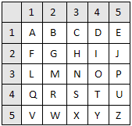
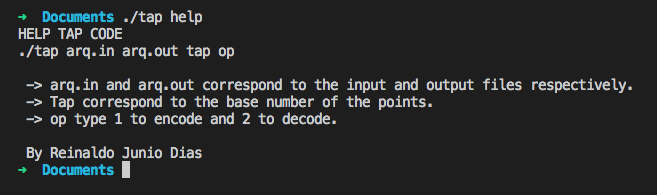
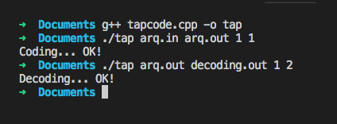

# TapCode
TapCode encoder and decoder


### History

The tap code, sometimes called the knock code, is a way to encode text messages on a letter-by-letter basis in a very simple way. The message is transmitted using a series of tap sounds, hence its name.

The tap code has been commonly used by prisoners to communicate with each other. The method of communicating is usually by tapping either the metal bars, pipes or the walls inside a cell.

The tap code is based on square using a 5×5 grid of letters representing all the letters of the Latin alphabet, except for K, which is represented by C.

The listener only needs to discriminate the timing of the taps to isolate letters.

[Wikipedia](https://en.wikipedia.org/wiki/Tap_code)


### Project

This project uses the following table:



With it the algorithm does the coding and decoding as the examples below:




Having the following coded text:

```
This is a test message from the tap code program.
```
 
 ```
.... .... .. ... .. .... .... ... .. .... .... ... . . .... .... . ..... .... ... .... .... ... .. . 
..... .... ... .... ... . . .. .. . ..... .. . .... .. ... .... ... .. .... .... .. ... . ..... .... 
.... . . ... ..... . ... ... .... . .... . ..... ... ..... .... .. ... .... .. .. .... .. . . ... .. 

```
